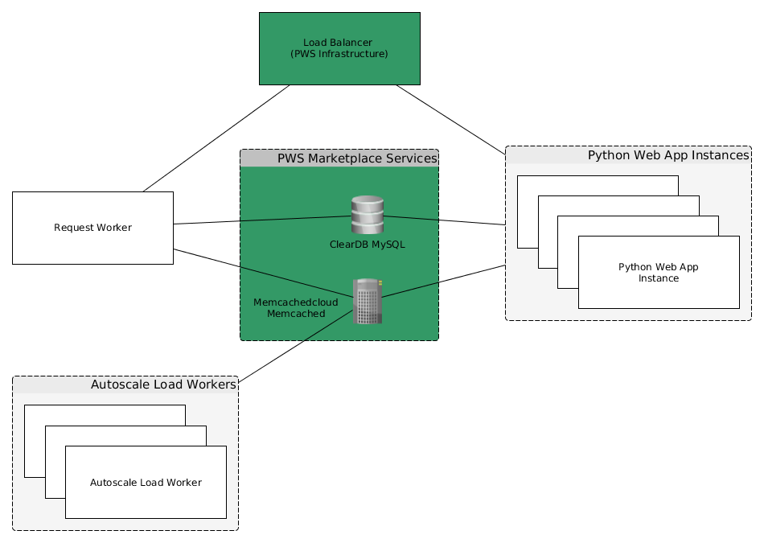

# pcf-demo-docs

This document describes the architecture as well as the two main workflows of the PCF Demo application. The demo tests PWS itself and the marketplace services ClearDB MySQL, 
Memcached Cloud Memcached and the App Autoscaler. The used approaches do not reflect sound production setups and were chosen for simplicity.

## Overall Architecture

The application utilizes Python and the Flask (Web) Micro Framework.
From the Pivotal Web Services Marketplace ClearDB MySQL, Memcached Cloud Memcached and App Autoscaler are utilized.

User interactions happen via the web-based Flask application. The main work is done by two different kinds of background workers. 
Their purposes and workflows are described in the following sections.

## Request Worker Workflow
The user can trigger a parallelized HTTP request run on the load balanced Web App Instances. The user can choose the amount of calls to be made.
The (trigger) information is communicated via simple <key,value>-pairs in the attached Memcached. 

Before triggering HTTP calls the request worker inserts an initial database row about the following HTTP call run. All HTTP request runs are identified by their (start) timestamp.
The according data is persisted in the attached MySQL database and can be viewed later via the web interface. The request worker uses a Thread Pool to make the HTTP request towards the 
potentially load-balanced (multiple) Web App instances. For every HTTP call the Web App updates the database row about the request run by incrementing a call counter. Since the request
calls are parallel (loadbalanced web app instances + caller threads), an data update race condition may happen. The demo is actually intended to trigger that race condition.

After the request run is over the workflow can be triggered again. The data of former request runs can be viewed on the 'Receiver Overview' page of the web interface.

### Data Structures

#### Trigger information (exchanged via Memcached)
* workInProgress -> True or False -> Lock to prevent the user from triggering more than one request run at once
* amountOfCalls -> Integer value -> How many calls shall be made for the next run?
* destinationURL -> URL -> Which URL shall be called via HTTP GET calls?

#### Request Run Data Persistence
* ID -> INT(11) -> autoincrement ID, database primary key
* timestamp -> INT(11) -> start timestamp of the request run
* current_request_count -> INT(11) -> counter to be updated during the request run (+1 per call)
* max_possible_count -> INT(11) -> maximum value of request calls (relates to amountOfCalls)

## CPU Load Worker Workflow
The purpose of the CPU Load Worker is to test the App Autoscaler addon, which shall scale the amount of running instances based on (CPU) load. Therefore lower and upper CPU load
thresholds for an app are set. The app instances shall scale up (upper threshold) or scale down (lower threshold). The idea is to always have an elastic, responsive app while 
potentially saving money in times with lower demand.
 
Basically the CPU Load Workers generate useless CPU load when switched on. After time the App Autoscaler addon should scale up or down. The user can switch the behavior (ON or OFF)
via web interface 'Autoscaler View'. The trigger information is stored and communicated via the attached Memcached store.

### Data Structures

#### Trigger information (exchanged via Memcached)
* CPULoad -> ON or OFF -> switch CPU load ON or OFF